% Assessing Phase Coherence in the Chiral Induced Spin Selectivity Effect: Review of Theoretical Approaches
% Aisha Kermiche
% University of California - Los Angeles, Department of Electrical Engineering, Quantum Biology Tech (QuBiT) Lab

________
## Outline
1. Introducing the CISS Effect
2. Potential applications
3. Literature review: ambiguities in experimental results 
4. Current work: reproduction of charge transport models
5. Future directions

## Objectives (in progress)
Recreate and compare theoretical models proposed in literature

Propose novel simulation approach to determine coherence of electron transport in chiral molecules

_______
# Overview of chiral induced spin selectivity effect

Unlike in man-made electronic devices, where electron transport is facilitated through metals and semimetals, biological systems rely on electron transport through diamagnetic, insulating molecules with minimum heat dissipation.

Chiral molecules can produce spin polarized electrons without the need for ferromagnetism, meaning they are promising as a new class to topological materials. 
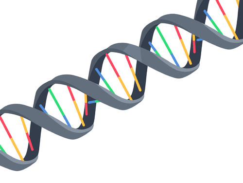

# Characteristics of the CISS effect
1. non-equilibrium effect, requiring electron transfer through chiral molecules 
2. requires large spin-orbit coupling (SOC) enhancement
3. flipping the chirality of the molecule flips the polarization
4. as of current evidence, polarization increases with increasing length of the chiral molecule.
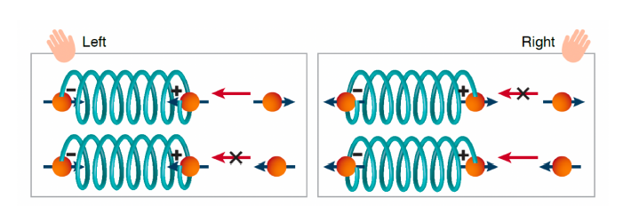
*S. Mishra _et al._, “Spin Filtering Along Chiral Polymers,” _Angewandte Chemie_, vol. 132, no. 34, pp. 14779–14784, 2020, doi: [10.1002/ange.202006570](https://doi.org/10.1002/ange.202006570).*

# Potential applications
- This ability to manipulate and control spin through charge transfer processes at room temperature with minimum heating can be exploited in the development of spintronic  devices, with implications for the transfer and storage of information in quantum computing applications. 
- In order to be useful, charge transfer must be coherent in these interconnects.
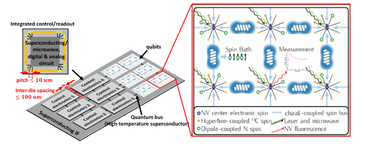
*C. Aiello, “Towards a Room-Temperature Hierarchical Interconnect System for Quantum Information Processing.” (accessed Dec. 09, 2021)*

# Classical intuition

:::::::::::::: {.columns}
::: {.column width="50%"}
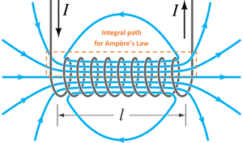{} 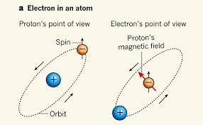{}
:::
::: {.column width="50%"}
 - Theoretical approaches so far have assumed a close connection between chirality and spin-orbit interaction.
- So perhaps it could be the quantum version of the solenoid field, chiral induced spin orbit coupling, could explain it, but still **the order of magnitude is far too small**. 

:::
::::::::::::::

# Experimental results

### Language of spin-flipping, spin-filtering is ambiguous	
- If the chiral molecule is truly "spin-filtering", that means that the wave function collapses as it is transmitted, rendering the effect useless for qubit transport (though it is still applicable for qubit preparation)
- Weizmann Institute group (original investigators of the effect) claim that experiments support the effect as spin filtering rather than spin flipping, and that their current model __does not require the charge transport to be coherent__. 
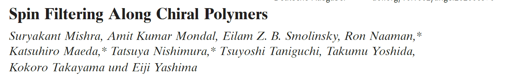

::: notes
- what I would like to do is look closely at the experiments they used to support these assertions.
:::

_______
:::::::::::::: {.columns}
::: {.column width="60%"}
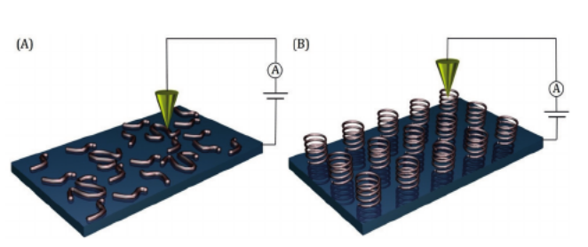{width=100%}
:::
::: {.column width="40%"}
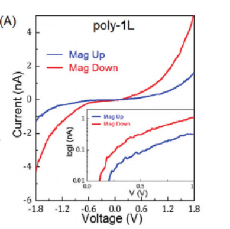){width=50%}
:::
::::::::::::::
____________

# Weizmann group conclusions

- The nonlinear I-V curves suggests that **back-scattering is suppressed**
- Spin polarization scales proportional to the length of the molecule. 
- **Because there is a different threshhold for each spin conduction this indicated no spin flipping**. The molecules are passive filters. They don't actively flip the spin, only reject unfavorable spins at a higher probability. 
- Polarization is similar to that obtained with photoelectrons
- **The spin orbit coupling allows for long range electron transfer**. It allows for electron transfer in proteins and biological systems because back scattering is suppressed. 

# Broad range of modeling approaches exist
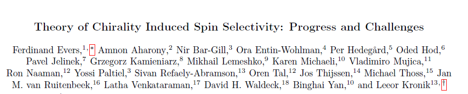
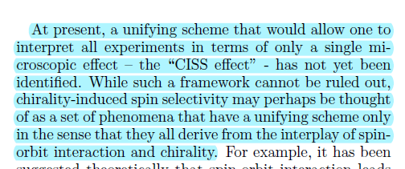

::: notes
- So there was a workshop at the Weizmann Institute in early 2020 which was a meeting of theorists, and this paragraph concluded the summary of the models
- I won't exhaustively examine each one, because they are so diverse, some are spin flipping, some have two different terminals, some are time-reversible, some are time-irreverible, I will try to focus on the ones that are relevant to what would be required for the effects to be coherent
:::

# Analytical tight binding, time reversible model

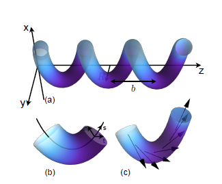{width=50%}
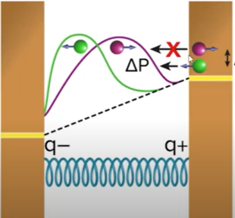{width=50%}
### Assumptions
- Tight binding model allows for wire to be treated as quasi-one dimensional
- Small SOC responding to large dipole
- **spin conduction does not have to be coherent in order to achieve the spin polarization**
::: notes
- so next I would like to include just a brief overview of my efforts as someone new to this field to recreate these models 
::: 

# Symmetry analysis
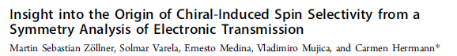

-Imaginary terms in the Hamiltonian are a result of spin orbit coupling, and they **preserve the Hermitian nature of the Hamiltonian**
- **SOC is not related to the breaking of time reversal symmetry**. Obeys **Kramer's Degeneracy**

# Applying Landauer Formalism 
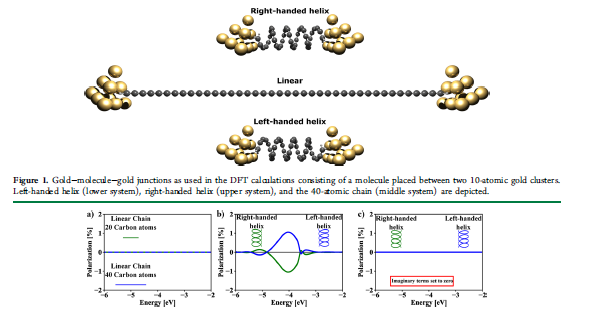
Full Green's function characterization of a chiral molecular junction, DFT

# Aharonov-Bohm (AB) Effect
- An electron experiences a phase difference due to a magnetic field.
- The induced phase has to undergo a time irreversible transformation, which can be done by either
	- Introducing an external magnetic field
	- Introducing leakages
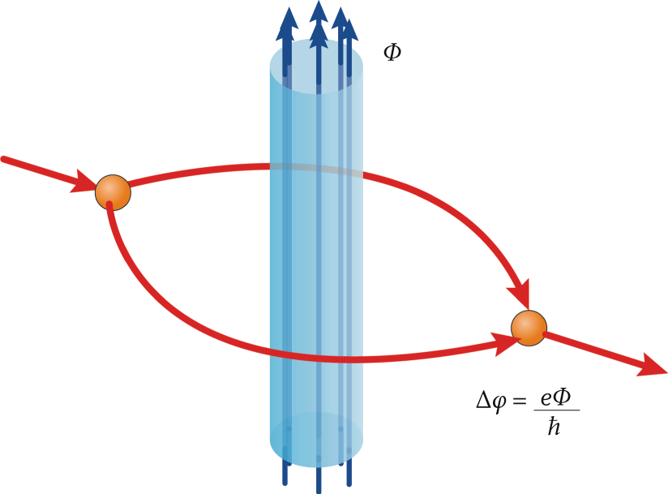{align=left,height=20%} {align=right}

_________
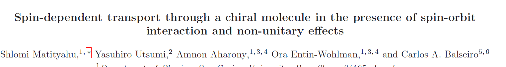

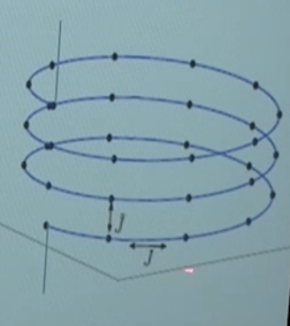{align=bottom,height=80%}
_________

# Tentative schedule of tasks in the coming months 
1. NEGF single electron model of electron transport
2. Seeing how the parameterization of the electron trajectory 
3. An examination of topological resonance when you change the pitch and frequency of the chiral molecule
4. A change in functional groups and how that affects the spin polarization and coherence
8. I want to be able to tie a thermodynamic account of information to the quantum mechanics of the CISS effect. The relevant textbooks include:

# Main conclusions
- Destruction of unitary transformation, either through the destruction of time reversal or reflection symmetry, may be necessary to achieve charge polarization
- Interference pattern is obtainable, implying that a phase superposition is preserved
- Main theoretical considerations are
	- Symmetry (time parity)
	- Leakages
	- Non-equilibrium effects

# Future work for the QuBiT lab
#### Introducing interferometry experiments into the investigation of the CISS effect
#### Relating CISS effect to spin-controlled reactions

